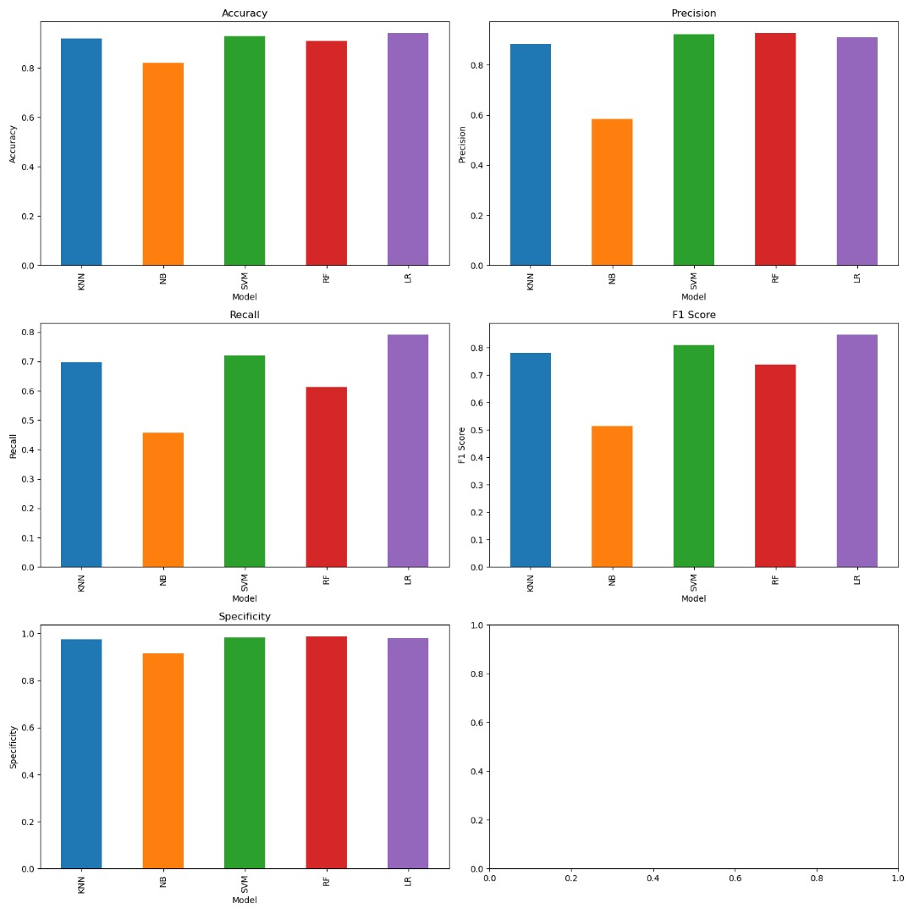

 
[](xxxxxx)
[](https://opensource.org/licenses/MIT) 

[](https://GitHub.com/omicscodeathon/denguedrug/releases/)

[](https://GitHub.com/omicscodeathon/denguedrug/graphs/contributors/)
[](https://github.com/omicscodeathon/denguedrug/tags/)

# denguedrug
**Machine Learning and Molecular Docking Prediction of Potential Inhibitors against Dengue Virus**

## Overview 
<p align="justify">
  In this project, we are building a <i>in silico</i> pipeline to identify novel dengue virus inhibitors. We will incorporate Deep/Machine Learning (DL/ML) and molecular modeling techniques into the pipeline.
</p>

<p align="justify">
  Dengue virus (DENV) is a <i>Flaviviridae</i> family member responsible for the most prevalent mosquito-borne viral hemorrhagic fever. Dengue virus transmission to humans primarily occurs through mosquito bites from species such as <i>Aedes aegypti</i> and <i>Aedes albopictus</i>, widespread in tropical and subtropical climates, including both urban and rural regions. The severe and sometimes fatal diseases known as Dengue hemorrhagic fever (DHF) and Dengue shock syndrome (DSS) can develop in certain people infected with DENV. The spread of dengue fever has resulted in several medical emergencies and deaths for which no drug is currently available. Despite its prevalence, the treatment administered is symptomatic. The structural information available for the DENV presented an opportunity to discover potent antiviral agents capable of disrupting the early stages of DENV infection. 
Our approach seeks to train different machine learning models using the Anti-Dengue dataset from PubChem to distinguish between potential anti-Dengue compounds and non-anti-Dengue compounds. Subsequently, we will further screen the predicted compounds against a Dengue protein target for downstream analysis. Details of the pipeline can be found in the workflow diagram presented in the "<a href="#description" _originalHref="https://github.com/omicscodeathon/denguedrug/edit/main/README.md#description" title="Detailed Workflow diagram of the project, from Data acquisition to Model implementation and Prediction, as well as Molecular Docking and MD Simulations.">description</a>" below.
</p>
<br>

<!---
<h2 id="formatting-content-within-your-table" tabindex="-1"><a class="heading-link" href="#formatting-content-within-your-table">Formatting content within your table<span class="heading-link-symbol" aria-hidden="true"></span></a></h2>
<p>You can use <a href="/en/get-started/writing-on-github/getting-started-with-writing-and-formatting-on-github/basic-writing-and-formatting-syntax" _originalHref="/get-started/writing-on-github/getting-started-with-writing-and-formatting-on-github/basic-writing-and-formatting-syntax">formatting</a> such as links, inline code blocks, and text styling within your table:</p>
--->


```geojson
{
  "type": "FeatureCollection",
  "features": [
    {
      "type": "Feature",
      "id": 1,
      "properties": {
        "ID": 0
      },
      "geometry": {
        "type": "Polygon",
        "coordinates": [
          [
              [25,33],
              [31,31],
              [38,20],
              [44,12],
              [52,11.5],
              [47,2],
              [39,-5],
              [41.5,-15],
              [35,-20],
              [30,-23],
              [21,-18],
              [25,33]
          ]
        ]
      }
    }
  ]
}
```
<p align="center"><b>East Africa Coordinates Mapping.</b></p>

<p align="justify">
  Please <a href="https://x.com/natfriedman/status/1420122675813441540/photo/1">cite</a> and <a href="https://docs.github.com/en/get-started/exploring-projects-on-github/saving-repositories-with-stars">star</a> the repository if you utilize the pipeline for research or commercial purposes.
</p>

## Table of contents
1. [Objectives](#objectives)
2. [Description](#description)
   - [Identification of Dengue Virus inhibitors database for ML training](#step-1-identification-of-dengue-virus-inhibitors-database-for-ml-training)
   - [Preprocessing](#step-2-preprocessing)
   - [Model construction](#step-3-model-construction)
   - [Prediction](#step-4-prediction)
   - [Molecular Docking](#step-5-molecular-docking)
   - [ADMET prediction](#step-6-admet-prediction)
   - [Molecular Dynamics (MD) Simulations](#step-7-molecular-dynamics-md-simulations)
3. [Manuscript](#manuscript)
4. [Results](#results)
   - [Data Acquisition and Processing](#data-acquisition-and-processing)
   - [Model Development and Evaluation](#model-development-and-evaluation)
   - [Prediction of Inhibitors and Compounds](#prediction-of-inhibitors-and-new-compounds)
   - [Target Selection and Molecular Docking of Predicted Compounds](#target-selection-and-molecular-docking-of-predicted-compounds)
   - [Mechanism of Binding Characterization of Selected Compounds](#mechanism-of-binding-characterization-of-selected-compounds)
   - [ADMET Screening of Selected Compounds](#admet-screening-of-selected-compounds)
   - [Molecular Dynamics Simulations](#molecular-dynamics-simulations)
   - [MMPBSA Computations](#mmpbsa-computations)
5. [How to use](#how-to-use)
6. [Data Availability](#data-availability)
7. [Reproducibility Prerequisites](#reproducibility-prerequisites)
8. [Credits](#credits)

## Objectives
- [X] Identify the Dengue virus protein target.
- [X] Identify Dengue virus ligand database for ML training and molecular modeling method validation.
- [X] Determine ML `python` algorithm to be utilized in the project.
- [X] Process ligand database and train ML model.
- [X] Evaluate ML performance and perform EDA.
- [X] Validate molecular modeling method using prepared ligand database (Actives vs Non-actives).
- [X] Virtual screening of predicted actives into identified protein crystal structures.
- [X] Assess and identify hits using criterion: docking score, interactions with important residues.
- [X] Assess hits ADMET properties.
- [X] Conduct MD simulations to determine compounds' binding mode stability and binding free energy.
- [X] Compile results.


## Description

<p align="center">
  <br>
  <font size="1">
  The figure illustrates the proposed DengueDrug pipeline to be utilized to identify Dengue Virus Inhibitors.</a>
   <br><br>
  </font> 
  
  <br>
  <font size="1">
  <b>Proposed Dengue Drug Identification Pipeline</b>
  </font>
</p>

### Step 1: Identification of Dengue Virus inhibitors database for ML training

<p align="justify">
  The ligand database was obtained from PubChem <a href="https://pubchem.ncbi.nlm.nih.gov/bioassay/651640">BioAssay ID: 651640</a>. The ligand database was experimentally generated using (<i>in vivo</i>) DENV2 CPE-Based HTS Measured in Cell-Based and Microorganism Combination System method by the <a href="http://www.broadinstitute.org/">Broad Institute</a>. A total of 347,136 compounds were analyzed for their Dengue Virus inhibition and 5,946 actives and 324,845 non-actives were identified. An active is represented as a compound that can exhibit an ATP activity level above 20% at 10 $\mu M$.
</p>

### Step 2: Preprocessing

 - The unprocessed database can be found [here](data/unprocessed_database_PubChem_651640).

 - The molecular descriptors of the actives and inactives were calculated using [PaDEL-Descriptors](http://www.yapcwsoft.com/dd/padeldescriptor/). The descriptors of the [actives and inactives](data) were calculated using the [Descriptor Calculator](scripts/DescriptorCalculator.py) Python script.

 - The actives and inactives databases were combined and all missing descriptors were filled with the value 0. Next dimensionality reduction was conducted using a variance filter (scikit-learn VarianceThreshold library)

 - The data was then standardized using the mean and standard deviation [metrics](data/metrics.csv)

### Step 3: Model construction

- The data was split into training, test, and external datasets. The training dataset was equivalent to 70% (14875 compounds) of the data set and the test and external data sets were equivalent to 15% (~3188) each. The training dataset contained 3105 actives vs 11770 inactives.

- The ML models were constructed using [lazy predict](https://github.com/shankarpandala/lazypredict) python package. The models that exhibited the greatest Accuracy, F1-score, Balanced Accuracy, and ROC AUC [metrics](figures/Lazy_predict_results.jpeg) were selected for validation.

- <p align="justify">The models chosen for further validation were K-Nearest Neighbours, Naive Bayes, Support Vector Machine, Random Forest and Logistic regression. The models can be found <a href="output/models">here</a>. Using K-fold splitting of the training data the models were cross-validated and the model's suitability was evaluated using the Accuracy, F1-score, Precision, Recall, and Specificity, and false and true positive and negative rate <a href="ML_results_for_model_selection.jpeg">metrics</a>.</p>

- The models' prediction ability was assessed using the test data. The model's prediction accuracy was determined using Accuracy, F1-score, Precision, and Recall [metrics](figures/Model_selection_results_on_test_dataset.png).

- The logistic regression (LR) model exhibited the greatest results on the test dataset and therefore was evaluated on the external dataset. The LR model obtained an 82% active and 98% inactive accuracy.

### Step 4: Prediction

- <p align="justify">The LR model was employed to screen the <a href="https://african-compounds.org/about/nanpdb/">Northern African Natural Products Database (NANPD)</a>, <a href="https://african-compounds.org/about/eanpdb/">East African Natural Products Database (EANPD)</a>, <a href="https://african-compounds.org/about/afrodb/">AfroDB</a> and <a href="http://tcm.cmu.edu.tw/about01.php?menuid=1">Tradtional Chinese Medicine (TCM) database</a>.</p>

- The natural compounds' chemical structures were prepared similarly to the training dataset and ~43,000 compounds were screened using the LR model.

- 7,722 compounds were predicted to be active and subsequently utilized for molecular docking

### Step 5: Molecular Docking

- The crystal structure of the dengue 2 virus envelope protein ([PDB: 10KE](https://doi.org/10.2210/pdb1OKE/pdb)) was identified for structure-based virtual screening.

- [AutoDock Vina](https://vina.scripps.edu) was utilized to screen the 7,722 compounds into the dengue 2 virus envelope protein.

- The potential hits were selected using the criterion:
  - AutoDock Vina binding score
  - Presence of binding interactions between important binding site residues and ligand (LigPlot + v1.4.5).
 
### Step 6: ADMET prediction

- The ADMET properties of the identified hits will be predicted using [SwissADME](http://www.swissadme.ch), applying Veber's rule and Lipinski's rule.
- The hits with potential pharmacokinetic and toxicity moieties will be removed.

### Step 7: Molecular Dynamics (MD) Simulations

- The hits binding mode stability will be assessed through 100-nanosecond (ns) MD simulations utilizing GROMACS.
- The stability will be assessed using metrics like root-mean-square deviation (RMSD) and fluctuation (RMSF), Radius of Gyration, etc.
- The compounds binding interactions retention with important residues throughout the MD simulations will be assessed with the [ProLIF](https://prolif.readthedocs.io/en/stable/) python library.
- The compounds' binding free energies throughout the MD simulation were calculated using Molecular Mechanics Poisson-Boltzmann Surface Area (MMPBSA).

## Manuscript

<p align="justify">When using the pipeline or findings for research or commercial purposes please <a href="https://x.com/natfriedman/status/1420122675813441540/photo/1">cite</a> our research.</p>

## Results

<p align="justify">
  From the various analyses and computations performed throughout this <i>in silico</i> exploration, the following results were obtained and observations made.
</p>

---

### Data Acquisition and Processing

<p align="justify">
  The bioactive dataset obtained from PubChem consisted of imbalanced data from which 1/3 where active compounds. As shown below, inactive compounds dominated the dataset. Using PaDEL, 1,444 molecular descriptors were generated, providing a mathematical representation of the compounds for QSAR modeling by converting chemical information about the compounds into numerical values. The dataset of 21,250 compounds was split into training, validation, and test sets as follows: 14,875 training data, 3,187 test data, and 3,188 externally held data. Applying a variance filter reduced the number of descriptors from 1,444 to 684 using a variance threshold of 0.1 to filter out descriptors with minimal variance, ensuring that only the most informative features were retained for subsequent modeling. 
</p>
<p align="center">
  <br>
  </font> 
  
  <br>
  <font size="1">
  <b>3D plot showing the correlation between the active and inactive compounds based on ALogP, XLogP, and Zagreb.</b>
  </font>
</p>

---

### Model Development and Evaluation

<p align="justify">
 Five machine learning algorithms (k-NN, Gaussian Naïve Bayes, SVM, Random Forest, and Logistic Regression) were employed to build robust predictive models, each assessed based on several statistical parameters including accuracy, precision, recall, and F1 score. LR produced the best results across most metrics, followed by the SVM model. The results of each model's performance are shown below.
</p>

<!---
  <table>
    <tr>
      <th>Model</th>
      <th>Accuracy</th>
      <th>Precision</th>
      <th>Recall</th>
      <th>F1 Score</th>
    </tr>
    <tr>
      <td>LR</td>
      <td>0.94</td>
      <td>0.91</td>
      <td>0.76</td>
      <td>0.83</td>
    </tr>
    <tr>
      <td>SVM</td>
      <td>0.93</td>
      <td>0.94</td>
      <td>0.71</td>
      <td>0.81</td>
    </tr>
    <tr>
      <td>KNN</td>
      <td>0.92</td>
      <td>0.89</td>
      <td>0.68</td>
      <td>0.77</td>
    </tr>
    <tr>
      <td>RF</td>
      <td>0.91</td>
      <td>0.94</td>
      <td>0.60</td>
      <td>0.73</td>
    </tr>
    <tr>
      <td>NB</td>
      <td>0.81</td>
      <td>0.55</td>
      <td>0.47</td>
      <td>0.51</td>
    </tr>
  </table>
--->

| Model | Accuracy | Precision | Recall | F1 Score |
| :---- | :------: | :-------: | :----: | :------: |
| LR    | 0.94     | 0.91      | 0.76   | 0.83     |
| SVM   | 0.93     | 0.94      | 0.71   | 0.81     |
| KNN   | 0.92     | 0.89      | 0.68   | 0.77     |
| RF    | 0.91     | 0.94      | 0.60   | 0.73     |
| NB    | 0.81     | 0.55      | 0.47   | 0.51     |

<p align="center">
  <br>
  </font> 
  
  <br>
  <font size="1">
  <b>Bar plot of model performance of each model based on statistical evaluation parameters.</b>
  </font>
</p>

---

### Prediction of Inhibitors and New Compounds 

<p align="justify">
  18 known Dengue Virus inhibitors retrieved from literature were used for initial testing and further validation of the model performance. The Logistic Regression model predicted 11 of these inhibitors as active, outperforming the other models as seen in the table below. Preprocessing of these compounds was conducted in the same manner as the training data to ensure consistency in descriptor calculation and transformation. Pentoxifylline, Prochlorperazine, and Balapiravir were correctly classified by LR, just to cite a few. The Logistic Regression model was employed to predict 812 compounds from the ZINC database and 1871 from the EANPDB database. Of the 2683 assessed compounds, <a href="output/ML output">933 compounds</a> were predicted to be active and suitable for further exploration. This approach sought to highlight the importance of appropriate descriptor selection and data preprocessing in QSAR modeling towards effectively handling imbalanced data.
</p>

<p align=center>
  <table>
    <tr>
      <th>Inhibitors</th>
      <th>Prediction</th>
      <th>Mechanism of Action</th>
      <th>References</th>
    </tr>
    <tr>
      <td>Pentoxifylline</td>
      <td>1</td>
      <td>Immune modulation</td>
      <td><a href="https://doi.org/10.1097/INF.0b013e3182575e6a">Salgado et al., 2012</a></td>
    </tr>
    <tr>
      <td>4-hydroxyphenyl retinamide</td>
      <td>0</td>
      <td>Inhibits viral replication</td>
      <td><a href="https://doi.org/10.1128/AAC.04177-14">Carocci et al., 2015</a>; <a href="https://doi.org/10.1093/infdis/jiu319">Fraser et al., 2014</a></td>
    </tr>
    <tr>
      <td>Prochlorperazine</td>
      <td>1</td>
      <td>Inhibits viral binding and viral entry</td>
      <td><a href="https://doi.org/10.1093/infdis/jiu377">Simanjuntak et al., 2015</a></td>
    </tr>
    <tr>
      <td>Balapiravir</td>
      <td>1</td>
      <td>Inhibits viral replication</td>
      <td><a href="https://doi.org/10.1093/infdis/jis470">Nguyen et al., 2013</a></td>
    </tr>
    <tr>
     <td>Bortezomib</td>
      <td>1</td>
      <td>Inhibits viral replication</td>
      <td><a href="https://doi.org/10.1016/j.chembiol.2022.10.003">Ci et al., 2023</a></td>
    </tr>
    <tr>
     <td>Leflunomide</td>
      <td>1</td>
      <td>Immunosuppressive effects</td>
      <td><a href="https://doi.org/10.1007/s10875-011-9578-7">Wu et al., 2011</a></td>
    </tr>
    <tr>
     <td>SKI-417616</td>
      <td>1</td>
      <td>Inhibition of D4R suppressed DENV infection</td>
      <td><a href="https://doi.org/10.1128/JVI.00365-14">Smith et al., 2014</a></td>
    </tr>
    <tr>
     <td>Celgosivir</td>
      <td>1</td>
      <td>Inhibits viral replication</td>
      <td><a href="https://doi.org/10.1248/cpb.c17-00794">Tian et al., 2018</a></td>
    </tr>
    <tr>
     <td>UV-4B</td>
      <td>1</td>
      <td>Inhibits viral replication</td>
      <td><a href="https://doi.org/10.3390/v13050771">Franco et al., 2021</a></td>
    </tr>
    <tr>
     <td>2-C-methylcytidine</td>
      <td>0</td>
      <td>Inhibits viral replication</td>
      <td><a href="https://doi.org/10.1016/j.antiviral.2015.01.002">Lee et al., 2015</a></td>
    </tr>
    <tr>
     <td>Ketotifen</td>
      <td>1</td>
      <td>Vascular leakage</td>
      <td><a href="https://doi.org/https://doi.org/10.1016/j.bcp.2017.01.005">Lai et al., 2017</a></td>
    </tr>
    <tr>
     <td>Chloroquine</td>
      <td>1</td>
      <td>Inhibits viral replication</td>
      <td><a href="https://doi.org/https://doi.org/10.1016/j.bcp.2017.01.005">Lai et al., 2017</a></td>
    </tr>
    <tr>
     <td>Dasatinib</td>
      <td>0</td>
      <td>RNA replication inhibition</td>
      <td><a href="https://doi.org/10.1128/JVI.00632-13">de Wispelaere et al., 2013</a></td>
    </tr>
    <tr>
     <td>Lovastatin</td>
      <td>0</td>
      <td>Inhibits viral replication</td>
      <td><a href="https://doi.org/10.1093/cid/civ949">Whitehorn et al., 2016</a></td>
    </tr>
    <tr>
     <td>ST-148</td>
      <td>0</td>
      <td>Inhibits viral replication</td>
      <td><a href="https://doi.org/10.1128/AAC.01429-12">Byrd et al., 2013</a></td>
    </tr>
    <tr>
     <td>Dexamethasone</td>
      <td>0</td>
      <td>Inhibits viral replication</td>
      <td><a href="https://doi.org/10.1136/pgmj.2008.078444">Kularatne et al., 2009</a></td>
    </tr>
    <tr>
     <td>Prednisolone</td>
      <td>1</td>
      <td>Inhibits viral replication</td>
      <td><a href="https://doi.org/https://doi.org/10.1016/j.bcp.2017.01.005">Lai et al., 2017</a></td>
    </tr>
    <tr>
     <td>Ivermectin</td>
      <td>0</td>
      <td>Helicase inhibition</td>
      <td><a href="https://doi.org/10.1371/journal.pntd.0006934">Xu et al., 2018</a></td>
    </tr>
  </table>
</p>

&emsp; 0 = Inactive; 1 = Active

-----

### Target Selection and Molecular Docking of Predicted Compounds

<p align="justify">
  In this study, the NS2B/NS3 protease was preferentially selected as the target structure amongst the seven nonstructural proteins of the Dengue Virus for confirmation of the LR model prediction model. The NS2B/NS3 protease is an essential enzyme for viral replication and assembly, making it one of the principal antiviral targets for developing therapeutics against the virus. There are two potential locations for inhibiting DENV protease: the active site; and the attachment site of protease (NS3) to its protein cofactor (NS2B). The active site on the NS3 which is the prime target is made up of a conserved catalytic triad like His51-Asp75-Ser135. Exploration via the Protein Data Bank repository in search of a solved structure of the NS2B/NS3 for the Dengue Virus serotype showed IDs like 4M9T, 2FOM, 4M9M, and 4M9I with resolutions 1.74, 1.50, 1.53, 2.40 Å and R-value work of 0.215, 0.176, 0.203 and 0.215 respectively. The 2FOM, solved using x-ray diffraction, was selected for this study since it had the lowest resolution and R-value. The three-dimensional structure of the 2FOM with a ligand docked in the active site can be seen below.
</p>

<p align="center">
  <br>
  </font> 
  
  <br>
  <font size="1">
  <b>PyMOL visualization of NS2B/NS3 protease structure with ligand docking. [A. Pale-yellow cartoon structure representation; B. Light-green surface representation of protein with a ligand (blue) docked in its active site].</b>
  </font>
</p>

<p align="justify">
  A total of 853 compounds from the Logistic Regression prediction were docked into the active site of the target using <a href="https://doi.org/10.1002/jcc.21334">Autodock Vina</a>. Anhydrophlegmacin showed the highest binding affinity of -9.2 kcal/mol towards the protease amongst all docked ligands. The docked compounds demonstrated binding affinities between -9.2 and -3.6 kcal/mol, reinforcing the prediction ability of the LR model. Applying a threshold of -8.0 kcal, <a href="output/Molecular Docking/Supplemental 1 - Binding energies and intermolecular interactions between compounds and NS2B_NS3 protease.csv">59 compounds</a> with energies of -8.0 kcal/mol or better were selected for further analysis. This threshold was higher than -7.0 kcal/mol, taken as standard threshold for a compound to be considered active against a particular target (<a href="https://doi.org/10.1002/cbdv.202200160">Kwofie et al., 2022</a>). <b>The higher the binding affinity, the stronger the bond between the ligands and the target protein</b>. The protein in the complex with the ligands was visually inspected using PyMOL to select the best-docked. Known inhibitors (Leflunomide and Prednisolone) were also incorporated into the docking stage to act as a control, demonstrating binding affinities of -7.1 and 7.0 kcal/mol respectively. The <a href="output/Molecular%20Docking/ranked_output.tab">binding affinities</a> of the predicted compounds and inhibitors were recorded.
</p>

-----

### Mechanism of Binding Characterization of selected compounds

<p align="justify">
  In continuation of the structure-based molecular docking, to further confirm the binding affinities of the predicted compounds, the interactions of the compounds within the predicted binding pocket were determined. The biomolecular interactions between the NS2B/NS3 protease and the compounds were generated via LigPlot. Characterizing the binding interactions enabled the identification of critical residues within the active sites of the respective targets. To identify the compound that best inhibits the activities of the NS2B/NS3 protease, hydrogen and hydrophobic interactions between the shortlisted compounds and the residues in the active site were elucidated.
</p>

<p align="justify">
  For the interactions of the protease, the ligands docked to the active site were seen to interact with the proposed residues such as His51, Ser135, Leu128, Pro132, Ser131, Tyr161, and Asp75, as shown for the best hits in the Table below and fully detailed in the <a href="output/Molecular Docking/Supplemental 1 - Binding energies and intermolecular interactions between compounds and NS2B_NS3 protease.csv">supplementary file</a>. Anhydrophlegmacin and anhydrophlegmacin-9,10-quinones_B2 which had the highest binding affinities interacted with similar residues such as His51, Asp75, Gly151, Leu128, Pro132, and Gly153. They interacted with conserved catalytic triad residues Asp75, Ser135, and His51 through hydrogen bonding with bond lengths of 2.57, 3.06, and 2.86 Å respectively. The inhibitor Prednisolone interacted via hydrogen bonding with Gly151 (2.90 Å, 2.71 Å), Asp75 (2.95 Å), His51 (3.21 Å), Gly153 (2.93 Å, 3.16 Å). In addition ZINC14441502 formed hydrogen bonds with Gly151 and Ser135 with bond length 2.86 and 2.99 Å respectively; and hydrophobic bonding with Leu128, Gly153, Asn152, Val72, Asp75, His151 and Phe130. <b>39</b> out of 56 hits docked firmly and interacted with critical residues in the active site, and were selected for downstream analysis.
</p>

| Compound names | Binding Affinity ($`kcal/mol`$) | Hydrogen bonding with bond length ($`Å`$) | Hydrophobic contacts |
| :------------- | :-----------------------------: | :---------------------------------------: | :------------------: |
| anhydrophlegmacin | -9.2     | Asn152 (2.76), Gly153 (2.88), Ser135 (3.06), Gly151 (2.86) | Val72, Asp75, His51, Pro132, Tyr150, Leu128 |
| anhydrophlegmacin-9,10-quinones_B2 | -9.2     | Val72 (2.96), Asp75 (2.57), His51 (2.86), Lys73 (2.94) | Leu128, Pro132, Gly151, Gly153, Tyr161, Trp50 |
| ZINC000035941652   | -9.1   | Leu149 (3.06)  | Trp83, Asn152, Ala164, Ile165, Lys73, Asn167, Thr120, Ile123, Ala166, Lys74, Gly148, Leu76 |
| chryslandicin    | -9.0   | Val72 (2.74)  | Gly153, Trp50, His51, Tyr161, Leu128, Pro132, Gly151, Asn152, Asp75  |
| ZINC000085594516 | -8.8   | Ser135 (3.09)  | Leu128, Tyr150, Pro132, Phe130, Gly151, His51, Asn152, G1y153, Asp75  |
| 6a,12a-dehydromillettone | -8.7 | None   | His151, Asp75, Gly151, Gly153, Tyr150, Phe130, Pro132, Leu128  |
| ZINC000028462577 | -8.6  | Ser135 (2.67), Val72 (2.94) | Trp50, Gly151, Leu128, Phe130, His51, Gly153, Pro132, Tyr150  |
| anhydrophlegmacin-9',10'-quinone | -8.6   | Asn152 (2.88), Gly153 (2.84), Ser135 (2.94)  | Asp75, Val154, Val72, Trp50, His51, Pro132, Leu128, Gly151  |
| 2',4'-dihydroxychalcone-(4-O-5''')-4'',2''',4'''-trihydroxychalcone | -8.6  | Leu149 (2.99), Thr120 (3.26)  | Val154, Lys73, Val72, Asn152, His51, Asp75, Gly148, Leu76, Gly153. Trp83, Lys74, Ile165, Ala166, Ala164, Asn167, Ile123  |
| ZINC000095485910  | -8.6  | Phe130 (2.71)  | Ser135, Gly151, Leu128, His51, Asp75, Gly153, Pro132, Tyr150  |
| ZINC000095485955  | -8.6  | Trp83 (2.84), Leu149 (3.20), Asn152 (2.80)  | Gly87, Val146, Met149, Leu76, Ala164, Asn167, Ile165, Ala166, Gly148, Leu85, Val147  |
| ZINC000095486025  | -8.5  | Leu128 (3.34) Gly153 (2.87)  | Val72, His51, Asp75, Ser135, Gly151, Phe130, Pro132, Tyr150, Tyr161, Val54, Lys73, Asn152  |
| ZINC000038628344  | -8.5  | His51 (2.89), Ser135 (2.68), Asp75 (2.57), Phe130 (3.06), Tyr150 (3.10)  | Pro132, Ser131, Leu128, Tyr161, Gly153, Gly151  |
| ZINC000095486053  | -8.4  | Gly151 (2.99)  | His51, Pro132, Tyr150, Ser135, Phe130, Leu128  |
| phaseollidin  | -8.4  | Gly87 (2.83), Val146 (2.98)  | Leu85, Trp83, Gly148, Leu149, Ala164, Leu76, Asn167. Asn152, Lys74, Ile165, Trp89, Ala166, Glu88, Glu86, Val147  |
| 6-oxoisoiguesterin  | -8.4  | Tyr150 (2.80, Phe130 (3.16, 2.83)  | Ser131, Leu128, Gly151, Gly153, His51, Pro132  |
| ZINC000095486052  | -8.4  | Asn152 (3.20), Gly153 (3.14)  | Pro132, Tyr150, Leu128, Tyr161, Gly151, His151, Asp75  |
| ZINC000014444870  | -8.4  | Asn152 (3.01), Leu149 (3.19)  | Leu85, Val147, Gly87, Val146, Asn167, Ile165, Val54, Ala164, Ile123, Lys74, Gly148, Leu76, Trp83  |
| Leflunomide  | -7.1  | None  | Asn152, Val54, Ala64, Asn167, Leu76, Lys74, Ile123, Ala166  |
| Prednisolone  |  7.0  | Gly151 (2.90, 2.71), Asp75 (2.95), His51 (3.21), Gly153 (2.93, 3.16)  | Leu128, Phe130, Asn152, Ser135, Pro132  |


<p align="justify">
  A visual representation of these interactions can be observed with the ZINC38628344, which had binding affinity of -8.5 kcal/mol with the NS2B/NS3 protease formed hydrogen bond interaction with His51 (2.89 Å), Ser135 (2.68 Å), Asp75 (2.57 Å), Phe130 (3.06 Å), Tyr150 (3.10 Å) and hydrophobic interactions with residues Pro132, Ser131, Leu128, Tyr161, Gly153, Gly151 as presented below.
</p>

<p align="center">
  <br>
  </font> 
  
  <br>
  <font size="1">
  <b>Ligand ZIN38628344 docked in NS2B/NS3 binding pocket; 2D protein-ligand interaction diagram generated using PyMOL and LigPlot respectively.</b>
  </font>
</p>

-----

### ADMET Screening of Selected Compounds

<p align="justify">
  When using the pipeline or findings for research or commercial purposes please <a href="https://x.com/natfriedman/status/1420122675813441540/photo/1">cite</a> our research.
</p>

------

### Molecular Dynamics Simulations

<p align="justify">
  When using the pipeline or findings for research or commercial purposes please <a href="https://x.com/natfriedman/status/1420122675813441540/photo/1">cite</a> our research.
</p>

Here is a simple flow chart:


#### Root mean square deviation (RMSD) for 100 ns MD simulations

<p align="justify">
  When using the pipeline or findings for research or commercial purposes please <a href="https://x.com/natfriedman/status/1420122675813441540/photo/1">cite</a> our research.
</p>

<p align="center">
  <br>
  </font> 
  
  <br>
  <font size="1">
  <b>Bar plot of model performance of each model based on statistical evaluation parameters.</b>
  </font>
</p>


#### Radius of gyration for 100 ns MD simulations

<p align="justify">
  When using the pipeline or findings for research or commercial purposes please <a href="https://x.com/natfriedman/status/1420122675813441540/photo/1">cite</a> our research.
</p>

<p align="center">
  <br>
  </font> 
  
  <br>
  <font size="1">
  <b>Bar plot of model performance of each model based on statistical evaluation parameters.</b>
  </font>
</p>


#### Root mean square fluctuations (RMSF) for 100 ns MD simulations

<p align="justify">
  When using the pipeline or findings for research or commercial purposes please <a href="https://x.com/natfriedman/status/1420122675813441540/photo/1">cite</a> our research.
</p>

<p align="center">
  <br>
  </font> 
  
  <br>
  <font size="1">
  <b>Bar plot of model performance of each model based on statistical evaluation parameters.</b>
  </font>
</p>

------

### MMPBSA Computations

<p align="justify">
  When using the pipeline or findings for research or commercial purposes please <a href="https://x.com/natfriedman/status/1420122675813441540/photo/1">cite</a> our research.
</p>

#### Contributing Energy Terms 

<p align="justify">
  When using the pipeline or findings for research or commercial purposes please <a href="https://x.com/natfriedman/status/1420122675813441540/photo/1">cite</a> our research.
</p>

#### Per-residue Energy Decomposition

<p align="justify">
  When using the pipeline or findings for research or commercial purposes please <a href="https://x.com/natfriedman/status/1420122675813441540/photo/1">cite</a> our research.
</p>

<p align="center">
  <br>
  </font> 
  
  <br>
  <font size="1">
  <b>Bar plot of model performance of each model based on statistical evaluation parameters.</b>
  </font>
</p>


-------

## How to use

<p align="justify">The <a href="docs">documentation</a> and <a href="notebooks">tutorial</a> give a general overview of how the [pipeline](pipeline/README.md) can be utilized to identify novel Dengue Virus inhibitors.</p>

**Tutorial 1**

[ML pipeline](notebooks/ML_Dengue.ipynb) describes how the models were constructed, validated and selected.

**Tutorial 2**

Molecular docking and dynamics

## Data Availability

The data utilized for the project can be found [here](data).

## Reproducibility Prerequisites

> [!NOTE]
> <p align="justify">The codes and scripts were run on <a href="https://www.python.org/ftp/python/3.8.0/python-3.8.0-amd64.exe"><b>Python 3.8</b></a>, <a href=""><b>Anaconda 2023</b></a> and <b>Jupyter Notebook version</b>.</p>
> 
> <a href="https://cran.r-project.org/bin/windows/base/old/4.3.0/R-4.3.0-win.exe"><b>R 4.3.0</b></a> was used for some of the data visualization.

## Credits

**The Team members include:**
1. George Hanson – George.hanson417@gmail.com
2. Joseph Adams - jkojoadams@gmail.com
3. Kepgang Daveson Innocento Brank - davesonbrank@gmail.com
4. Andy Asante - pkandy001@gmail.com
5. Emmanuel Israel Nsedu - emmanuel.israelpgs@stu.cu.edu.ng
6. Hem Bondarwad – hembondarwad@gmail.com
7. Kisaakye Maureen -  maureenkisaakye6@gmail.com
8. Lewis Tem Bueh -  lewistem8@gmail.com
9. Luke Zondagh -  lukeshandzondagh@gmail.com
10. Soham Amod Shirolkar -  sohamshirolkar@usf.edu
11. Olaitan I. Awe - laitanawe@gmail.com


