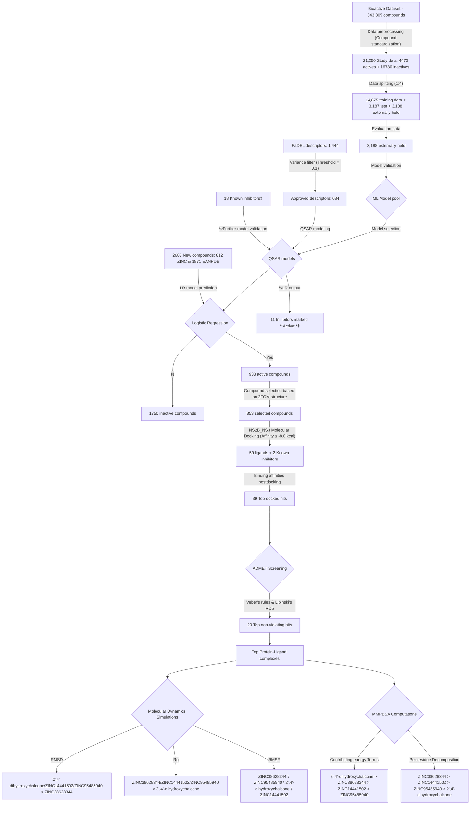

 
[](xxxxxx)
[](https://opensource.org/licenses/MIT) 

[](https://GitHub.com/omicscodeathon/denguedrug/releases/)

[](https://GitHub.com/omicscodeathon/denguedrug/graphs/contributors/)
[](https://github.com/omicscodeathon/denguedrug/tags/)

# denguedrug

<font size="2">
  <b>Machine Learning and Molecular Docking Prediction of Potential Inhibitors against Dengue Virus.</b>
</font>

## Overview 
<p align="justify">
  This project aims at building an <i>in silico</i> pipeline to identify novel Dengue Virus inhibitors. We will incorporate Machine Learning (ML) and Molecular Modeling techniques into the pipeline.
</p>

<p align="justify">
  Dengue virus (DENV) is a <i>Flaviviridae</i> family member responsible for the most prevalent mosquito-borne viral hemorrhagic fever. Dengue virus transmission to humans primarily occurs through mosquito bites from species such as <i>Aedes aegypti</i> and <i>Aedes albopictus</i>, widespread in tropical and subtropical climates, including both urban and rural regions. The severe and sometimes fatal diseases known as Dengue hemorrhagic fever (DHF) and Dengue shock syndrome (DSS) can develop in certain people infected with DENV. The spread of dengue fever has resulted in several medical emergencies and deaths for which no drug is currently available. Despite its prevalence, the treatment administered is symptomatic. The structural information available for the DENV presented an opportunity to discover potent antiviral agents capable of disrupting the early stages of DENV infection. Regions with a high prevalence of Dengue virus infection in Africa are highlighted in the figure below.
Our approach seeks to train different Machine Learning models using the Anti-Dengue dataset from PubChem to discriminate potential anti-Dengue compounds from non-anti-Dengue compounds. Subsequently, we will further screen the predicted compounds against a Dengue protein target for downstream analysis. Details of the <a href="#workflow-diagram">pipeline</a> can be found in the presented in the  "<a href="#description-section" _originalHref="https://github.com/omicscodeathon/denguedrug/edit/main/README.md#description" title="Detailed Workflow diagram of the project, from Data acquisition to Model implementation and Prediction, as well as Molecular Docking and MD Simulations.">description</a>" section.
</p>
<br>

<!---
<h2 id="formatting-content-within-your-table" tabindex="-1"><a class="heading-link" href="#formatting-content-within-your-table">Formatting content within your table<span class="heading-link-symbol" aria-hidden="true"></span></a></h2>
<p>You can use <a href="/en/get-started/writing-on-github/getting-started-with-writing-and-formatting-on-github/basic-writing-and-formatting-syntax" _originalHref="/get-started/writing-on-github/getting-started-with-writing-and-formatting-on-github/basic-writing-and-formatting-syntax">formatting</a> such as links, inline code blocks, and text styling within your table:</p>
--->


```geojson
{
  "type": "FeatureCollection",
  "features": [
    {
      "type": "Feature",
      "id": 1,
      "properties": {
        "ID": 0
      },
      "geometry": {
        "type": "Polygon",
        "coordinates": [
          [
              [25,33],
              [31,31],
              [38,20],
              [44,12],
              [52,11.5],
              [47,2],
              [39,-5],
              [41.5,-15],
              [35,-20],
              [30,-23],
              [21,-18],
              [25,33]
          ]
        ]
      }
    }
  ]
}
```
<p align="center"><b>East Africa Coordinates Mapping of High Dengue prevalence regions.</b></p>

<p align="justify">
  Please <a href="https://x.com/natfriedman/status/1420122675813441540/photo/1"><b>cite</b></a> and <a href="https://docs.github.com/en/get-started/exploring-projects-on-github/saving-repositories-with-stars"><b>star</b></a> the repository if you utilize the pipeline for research or commercial purposes.
</p>

## Table of contents
1. [Objectives](#objectives)
2. [Description](#description)
   - [Identification of Dengue Virus inhibitors database for ML training](#step-1-identification-of-dengue-virus-inhibitors-database-for-ml-training)
   - [Preprocessing](#step-2-preprocessing)
   - [Model construction](#step-3-model-construction)
   - [Prediction](#step-4-prediction)
   - [Molecular Docking](#step-5-molecular-docking)
   - [ADMET prediction](#step-6-admet-prediction)
   - [Molecular Dynamics (MD) Simulations](#step-7-molecular-dynamics-md-simulations)
3. [Manuscript](#manuscript)
4. [Results](#results)
   - [Data Acquisition and Processing](#data-acquisition-and-processing)
   - [Model Development and Evaluation](#model-development-and-evaluation)
   - [Prediction of Inhibitors and Compounds](#prediction-of-inhibitors-and-new-compounds)
   - [Target Selection and Molecular Docking of Predicted Compounds](#target-selection-and-molecular-docking-of-predicted-compounds)
   - [Mechanism of Binding Characterization of Selected Compounds](#mechanism-of-binding-characterization-of-selected-compounds)
   - [ADMET Screening of Selected Compounds](#admet-screening-of-selected-compounds)
   - [Molecular Dynamics Simulations](#molecular-dynamics-simulations)
   - [MMPBSA Computations](#mmpbsa-computations)
5. [How to use](#how-to-use)
6. [Data Availability](#data-availability)
7. [Reproducibility Prerequisites](#reproducibility-prerequisites)
8. [Credits](#credits)

## Objectives
- [X] Identify the Dengue virus protein target.
- [X] Identify Dengue virus ligand database for ML training and molecular modeling method validation.
- [X] Determine ML `python` algorithm to be utilized in the project.
- [X] Process ligand database and train ML model.
- [X] Evaluate ML performance and perform EDA.
- [X] Validate molecular modeling method using prepared ligand database (Actives vs Non-actives).
- [X] Virtual screening of predicted actives into identified protein crystal structures.
- [X] Assess and identify hits using criterion: docking score, interactions with important residues.
- [X] Assess hits ADMET properties.
- [X] Conduct MD simulations to determine compounds' binding mode stability and binding free energy, and MMPBSA computations.
- [X] Compile results and observations.
- [X] Finalize write-up.


## Description
<a name="description-section"></a>
<br>
This figure illustrates the proposed DengueDrug pipeline to be utilized to identify potent Dengue Virus Inhibitors.
<br>
<p align="center">
  <br>
  </font>
  <a name="workflow-diagram"></a>
  
  <br>
  <font size="1">
  <b>Fig. Proposed Dengue Drug Identification Pipeline.</b>
  </font>
</p>

### Step 1: Identification of Dengue Virus inhibitors database for ML training

<p align="justify">
  The ligand database was obtained from PubChem <a href="https://pubchem.ncbi.nlm.nih.gov/bioassay/651640">BioAssay ID: 651640</a>. The ligand database was experimentally generated using "<i>in vivo</i>" DENV2 CPE-Based HTS computed in Cell-Based and Microorganism Combination System, method by the <a href="http://www.broadinstitute.org/">Broad Institute</a>. A total of 347,136 compounds were analyzed for their Dengue Virus inhibition and 5,946 actives and 324,845 non-actives were identified. An active is represented as a compound that can exhibit an ATP activity level above <b>20%</b> at <b>10 $\mu M$</b>.
</p>

### Step 2: Preprocessing

 - The unprocessed database can be found [here](data/unprocessed_database_PubChem_651640).

 - The molecular descriptors of the [actives](data/Actives.smi) and [inactive](data/Inactives.smi) were calculated using [PaDEL-Descriptors](http://www.yapcwsoft.com/dd/padeldescriptor/). The descriptors of the [actives and inactives](data) were calculated using the [`Descriptor Calculator`](scripts/DescriptorCalculator.py) Python script.

 - The actives and inactives databases were combined and all missing descriptors were filled with the value 0. Next, dimensionality reduction was conducted using a variance filter (scikit-learn VarianceThreshold library).

 - The data was then standardized using the mean and standard deviation [metrics](data/metrics.csv) of various assessment parameters.

### Step 3: Model construction

- The data was split into [training](data/Training%20Data.csv.zip) , [test](data/Test%20Data.csv), and [external](data/External%20Data.csv) datasets. The training dataset was equivalent to 70% (14875 compounds) of the data set and the test and external data sets were equivalent to 15% (~3188) each. The training dataset contained 3105 actives vs 11770 inactives.

- The ML models were constructed using [lazy predict](https://github.com/shankarpandala/lazypredict) python package. The models that exhibited the greatest Accuracy, F1-score, Balanced Accuracy, and ROC AUC [metrics](figures/Lazy_predict_results.jpeg) were selected for validation.

- <p align="justify">The <a href="output/models">models</a> chosen for further validation were K-Nearest Neighbours, Gaussian Naïve Bayes, Support Vector Machine, Random Forest and Logistic regression. Using K-fold splitting of the training data, the models were cross-validated and the model's suitability was evaluated using the Accuracy, F1-score, Precision, Recall, and Specificity, and false and true positive and negative rate as <a href="ML_results_for_model_selection.jpeg">selection metrics</a>.</p>

- The models' prediction ability was assessed using the test data. The model's prediction accuracy was determined using Accuracy, F1-score, Precision, and Recall [evaluation metrics](figures/Model_selection_results_on_test_dataset.png).

- The logistic regression (LR) model exhibited the greatest results on the test dataset and therefore was evaluated on the external dataset. The LR model obtained an 82% active and 98% inactive accuracy.

### Step 4: Prediction

- <p align="justify">The LR model was employed to screen the <a href="https://african-compounds.org/about/nanpdb/">Northern African Natural Products Database (NANPD)</a>, <a href="https://african-compounds.org/about/eanpdb/">East African Natural Products Database (EANPD)</a>, <a href="https://african-compounds.org/about/afrodb/">AfroDB</a> and <a href="http://tcm.cmu.edu.tw/about01.php?menuid=1">Tradtional Chinese Medicine (TCM) database</a>.</p>

- The natural compounds' chemical structures were prepared similarly to the training dataset and ~43,000 compounds were screened using the LR model.

- 7,722 compounds were predicted to be active and subsequently utilized for molecular docking.

### Step 5: Molecular Docking

- The crystal structure of the Dengue 2 virus envelope protein ([PDB: 2FOM](https://doi.org/10.2210/pdb2FOM/pdb)) was identified for structure-based virtual screening.

- [AutoDock Vina](https://vina.scripps.edu) was utilized to screen the 7,722 compounds into the Dengue 2 virus envelope protein.

- The potential hits were selected using the criterion:
  - AutoDock Vina binding score.
  - Presence of binding interactions between important binding site residues and ligand ([LigPlot + v1.4.5](https://doi.org/10.1021/ci200227u)).
 
### Step 6: ADMET prediction

- The ADMET properties of the identified hits will be predicted using [SwissADME](http://www.swissadme.ch), applying <a href="https://doi.org/10.3390/molecules25020321">Veber's rule</a> and <a href="https://doi.org/10.1016/j.drudis.2019.10.014">Lipinski's Rule of Five</a> (Ro5).
- The hits with potential pharmacokinetic and toxicity moieties will be removed.

### Step 7: Molecular Dynamics (MD) Simulations

- The hits binding mode stability will be assessed through 100-nanosecond (ns) MD simulations utilizing <a href="https://doi.org/10.1021/ci500020m">GROMACS</a>.
- The stability will be assessed using metrics like root-mean-square deviation (RMSD) and fluctuation (RMSF), Radius of Gyration (Rg), etc., using <a href="https://doi.org/10.1163/_q3_SIM_00374">Xmgrace</a>.
- The compounds binding interactions retention with important residues throughout the MD simulations will be assessed with the [ProLIF](https://prolif.readthedocs.io/en/stable/) python library.
- The compounds' binding free energies throughout the MD simulation were calculated using <a href="https://doi.org/10.1021/ci500020m">Molecular Mechanics Poisson-Boltzmann Surface Area (MMPBSA)</a>.

## Manuscript

> [!IMPORTANT]
> <p align="justify"><b>When using the pipeline or findings for research or commercial purposes, please <a href="https://x.com/natfriedman/status/1420122675813441540/photo/1">cite</a> our research and <a href="https://docs.github.com/en/get-started/exploring-projects-on-github/saving-repositories-with-stars">star</a> the repository.</b></p>

## Results

<p align="justify">
  From the various analyses and computations performed throughout this <i>in silico</i> exploration, the following results were obtained and observations made.
</p>

---

### Data Acquisition and Processing

<p align="justify">
  The <a href="data/unprocessed_database_PubChem_651640/DENV2_PubChem_database_AID_651640_datatable.csv">bioactive dataset</a> obtained from <a href="https://pubchem.ncbi.nlm.nih.gov/">PubChem</a> consisted of imbalanced data from which 1/3 where active compounds, and inactives dominated the dataset as seen in <a href="#figure-1">Figure 1</a> below. <a href="https://doi.org/10.1002/jcc.21707">PaDEL</a> was used to generate 1,444 molecular descriptors, providing a mathematical representation of compounds for QSAR modeling via the convertion of chemical information to numerical values. The dataset of 21,250 compounds was split into: <a href="data/Training Data.csv.zip">14,875 training set</a>, <a href="data/Test Data.csv">3,187 test set</a>, and <a href="data/External Data.csv">3,188 externally-held set</a>. Applying a variance filter with threshold value <b><code>0.1</code></b> shortened descriptors from 1,444 to 684, filtering out those with minimal variance, guaranteeing only the most informative features were withheld for posterior modeling. 
</p>

<p align="center">
  <br>
  <a name="figure-1"></a>
  
  <br>
  <font size="1">
  <b>Figure 1.</b> Three-dimensional plot of the correlation between active and inactive compounds in the processed dataset according to ALogP, XLogP, and Zagreb.
  </font>
</p>

---

### Model Development and Evaluation

<p align="justify">
 Five machine learning algorithms (k-NN, Gaussian Naïve Bayes, SVM, Random Forest, and Logistic Regression) were employed to build robust predictive <a href="output/models">models</a>, each assessed based on several statistical parameters including the accuracy, precision, recall, and F1 score. LR produced the best results across most metrics, followed by the SVM model. With <i>81%</i> accuracy and an F1 score of <i>0.51</i>, Gaussian Naïve Bayes was depicted as least performing, and it struggled to balance between identification of true positives and minimization of false positives, given its low precision (0.55) and recall (0.47). Given its robustness via the various evaluation metrics, <a href="output/Models/LR_model.pkl">Logistic Regression</a> appeared as the most dependable model for predicting potential inhibitors (<a href="#table-1">Table 1</a>).
</p>

<!---
  <table>
    <tr>
      <th>Model</th>
      <th>Accuracy</th>
      <th>Precision</th>
      <th>Recall</th>
      <th>F1 Score</th>
    </tr>
    <tr>
      <td>LR</td>
      <td>0.94</td>
      <td>0.91</td>
      <td>0.76</td>
      <td>0.83</td>
    </tr>
    <tr>
      <td>SVM</td>
      <td>0.93</td>
      <td>0.94</td>
      <td>0.71</td>
      <td>0.81</td>
    </tr>
    <tr>
      <td>KNN</td>
      <td>0.92</td>
      <td>0.89</td>
      <td>0.68</td>
      <td>0.77</td>
    </tr>
    <tr>
      <td>RF</td>
      <td>0.91</td>
      <td>0.94</td>
      <td>0.60</td>
      <td>0.73</td>
    </tr>
    <tr>
      <td>NB</td>
      <td>0.81</td>
      <td>0.55</td>
      <td>0.47</td>
      <td>0.51</td>
    </tr>
  </table>
--->

**Table 1.<a name="table-1"></a>** Evaluation of ML models performance on retained datasets.

| Model | Accuracy | Precision | Recall | F1 Score |
| :---- | :------: | :-------: | :----: | :------: |
| LR    | 0.94     | 0.91      | 0.76   | 0.83     |
| SVM   | 0.93     | 0.94      | 0.71   | 0.81     |
| KNN   | 0.92     | 0.89      | 0.68   | 0.77     |
| RF    | 0.91     | 0.94      | 0.60   | 0.73     |
| NB    | 0.81     | 0.55      | 0.47   | 0.51     |

<p align="center">
  <br>
  <a name="figure-2"></a>
  
  <br>
  <font size="1">
  <b>Figure 2.</b> Bar plot of performance metrics for each Machine Learning model.
  </font>
</p>

---

### Prediction of Inhibitors and New Compounds 

<p align="justify">
  Eighteen (18) known Dengue Virus inhibitors sourced from literature were used for initial testing and to further ascertain the model performance. Amongst these inhibitors, the Logistic Regression model successfully depicted 11 as active as seen below (<a href="#table-2">Table 2</a>), surpassing the performance of other ML models. These compounds underwent the same preprocessing as training data to ensure consistency in descriptor calculation and transformation. Notable active compounds predicted by the LR model included Pentoxifylline, Prochlorperazine, Balapiravir, Celgosivir, and Bortezomib, to cite a few. This effective validation showed it could extrapolate to compounds with same mode of action. The <a href="output/Models/LR_model.pkl">LR model</a> was employed to predict activity in 812 and 1871 compounds from the ZINC and EANPDB databases respectively. Of the 2683 evaluated compounds, <a href="output/ML output"><b>933</b></a> were predicted as active and suitable for further investigation. This approach highlighted the significance of careful descriptor selection and data preprocessing in QSAR modeling toward properly addressing imbalanced data in anti-Dengue drug discovery.
</p>

**Table 2.<a name="table-2"></a>** Prediction results for known Dengue Virus inhibitors using LR.
<p align=center>
  <table>
    <tr>
      <th>N°</th>
      <th>Inhibitors</th>
      <th>Prediction</th>
      <th>Mechanism of Action</th>
      <th>References</th>
    </tr>
    <tr>
      <td>1</td>
      <td>Pentoxifylline</td>
      <td>1</td>
      <td>Immune modulation</td>
      <td><a href="https://doi.org/10.1097/INF.0b013e3182575e6a">Salgado et al., 2012</a></td>
    </tr>
    <tr>
      <td>2</td>
      <td>4-hydroxyphenyl retinamide</td>
      <td>0</td>
      <td>Inhibits viral replication</td>
      <td><a href="https://doi.org/10.1128/AAC.04177-14">Carocci et al., 2015</a>; <a href="https://doi.org/10.1093/infdis/jiu319">Fraser et al., 2014</a></td>
    </tr>
    <tr>
      <td>3</td>
      <td>Prochlorperazine</td>
      <td>1</td>
      <td>Inhibits viral binding and viral entry</td>
      <td><a href="https://doi.org/10.1093/infdis/jiu377">Simanjuntak et al., 2015</a></td>
    </tr>
    <tr>
      <td>4</td>
      <td>Balapiravir</td>
      <td>1</td>
      <td>Inhibits viral replication</td>
      <td><a href="https://doi.org/10.1093/infdis/jis470">Nguyen et al., 2013</a></td>
    </tr>
    <tr>
      <td>5</td>
      <td>Bortezomib</td>
      <td>1</td>
      <td>Inhibits viral replication</td>
      <td><a href="https://doi.org/10.1016/j.chembiol.2022.10.003">Ci et al., 2023</a></td>
    </tr>
    <tr>
      <td>6</td>
      <td>Leflunomide</td>
      <td>1</td>
      <td>Immunosuppressive effects</td>
      <td><a href="https://doi.org/10.1007/s10875-011-9578-7">Wu et al., 2011</a></td>
    </tr>
    <tr>
      <td>7</td>
      <td>SKI-417616</td>
      <td>1</td>
      <td>Inhibition of D4R suppressed DENV infection</td>
      <td><a href="https://doi.org/10.1128/JVI.00365-14">Smith et al., 2014</a></td>
    </tr>
    <tr>
      <td>8</td>
      <td>Celgosivir</td>
      <td>1</td>
      <td>Inhibits viral replication</td>
      <td><a href="https://doi.org/10.1248/cpb.c17-00794">Tian et al., 2018</a></td>
    </tr>
    <tr>
      <td>9</td>
      <td>UV-4B</td>
      <td>1</td>
      <td>Inhibits viral replication</td>
      <td><a href="https://doi.org/10.3390/v13050771">Franco et al., 2021</a></td>
    </tr>
    <tr>
      <td>10</td>
      <td>2-C-methylcytidine</td>
      <td>0</td>
      <td>Inhibits viral replication</td>
      <td><a href="https://doi.org/10.1016/j.antiviral.2015.01.002">Lee et al., 2015</a></td>
    </tr>
    <tr>
      <td>11</td>
      <td>Ketotifen</td>
      <td>1</td>
      <td>Vascular leakage</td>
      <td><a href="https://doi.org/https://doi.org/10.1016/j.bcp.2017.01.005">Lai et al., 2017</a></td>
    </tr>
    <tr>
      <td>12</td>
      <td>Chloroquine</td>
      <td>1</td>
      <td>Inhibits viral replication</td>
      <td><a href="https://doi.org/https://doi.org/10.1016/j.bcp.2017.01.005">Lai et al., 2017</a></td>
    </tr>
    <tr>
      <td>13</td>
      <td>Dasatinib</td>
      <td>0</td>
      <td>RNA replication inhibition</td>
      <td><a href="https://doi.org/10.1128/JVI.00632-13">de Wispelaere et al., 2013</a></td>
    </tr>
    <tr>
      <td>14</td>
      <td>Lovastatin</td>
      <td>0</td>
      <td>Inhibits viral replication</td>
      <td><a href="https://doi.org/10.1093/cid/civ949">Whitehorn et al., 2016</a></td>
    </tr>
    <tr>
      <td>15</td>
      <td>ST-148</td>
      <td>0</td>
      <td>Inhibits viral replication</td>
      <td><a href="https://doi.org/10.1128/AAC.01429-12">Byrd et al., 2013</a></td>
    </tr>
    <tr>
      <td>16</td>
      <td>Dexamethasone</td>
      <td>0</td>
      <td>Inhibits viral replication</td>
      <td><a href="https://doi.org/10.1136/pgmj.2008.078444">Kularatne et al., 2009</a></td>
    </tr>
    <tr>
      <td>17</td>
      <td>Prednisolone</td>
      <td>1</td>
      <td>Inhibits viral replication</td>
      <td><a href="https://doi.org/https://doi.org/10.1016/j.bcp.2017.01.005">Lai et al., 2017</a></td>
    </tr>
    <tr>
      <td>18</td>
      <td>Ivermectin</td>
      <td>0</td>
      <td>Helicase inhibition</td>
      <td><a href="https://doi.org/10.1371/journal.pntd.0006934">Xu et al., 2018</a></td>
    </tr>
  </table>
</p>

&emsp; 0 = Inactive, 1 = Active

-----

### Target Selection and Molecular Docking of Predicted Compounds

<p align="justify">
  This research focused on the <a href="https://doi.org/10.3389/fcimb.2023.1061937">NS2B/NS3 protease</a>, chosen as a primary target from the seven nonstructural proteins of the Dengue Virus to validate the Logistic Regression (LR) model predictions. As a crucial enzyme involved in the viral replication and assembly process, it acts as a significant target for antiviral drug development. Potential inhibition sites for the DENV protease include the active and binding site of the NS3 protease with its cofactor, NS2B. The active site, which is the main target for intervention, comprises a preserved catalytic triad consisting of His51, Asp75, and Ser135. Searching through the <a href="https://www.rcsb.org/">Protein Data Bank</a> revealed several solved structures for the NS2B/NS3 complex in Dengue Virus serotype, identified by PDB IDs like 4M9T, 2FOM, 4M9M, and 4M9I, with resolutions of 1.74, 1.50, 1.53, and 2.40 $Å$, and R-values of 0.215, 0.176, 0.203, and 0.215, respectively. For this study, 2FOM was selected due to its favorable resolution and R-value, allowing for visualization of its 3D structure with a ligand docked at the active site (possessing other residues like Leu128, Pro132, Ser131, & Tyr161), as represented below (<a href="#figure-3">Figure 3</a>).
</p>

<p align="center">
  <a name="figure-3"></a>
  
  <br>
  <font size="1">
  <b>Figure 3.</b> NS2B/NS3 protease structure as visualized in PyMOL, highlighting ligand docking. [A. Pale-yellow cartoon structure representation of the protein structure; B. Light-green surface representation of the protein with a ligand (blue) positioned in the active site].
  </font>
</p>

<p align="justify">
  853 compounds, curated from the <a href="output/ML output">total ML outputs</a>, predicted by the LR model were docked into the active site of the NS2B/NS3 protease using <a href="https://doi.org/10.1002/jcc.21334">Autodock Vina</a>. Among these, <b>anhydrophlegmacin</b> exhibited the highest binding affinity of <i>-9.2 $kcal/mol$</i>, surpassing all other docked ligands. The <a href="output/Molecular%20Docking/ranked_output.tab">binding affinities</a> of the compounds ranged from -9.2 to -3.6 $kcal/mol$, supporting the predictive capability of the Logistic Regression model. With a threshold set at -8.0 $kcal/mol$, <a href="output/Molecular Docking/Supplemental 1 - Binding energies and intermolecular interactions between compounds and NS2B_NS3 protease.csv">59 compounds</a> with equivalent or better binding energies were selected for further investigation. This threshold exceeded the conventional -7.0 $kcal/mol$ standard for classifying compounds as active against a given target(<a href="https://doi.org/10.1002/cbdv.202200160">Kwofie et al., 2022</a>). The binding affinity reflects the strength of interaction between ligands and target protein. Visual inspections of protein-ligand complexes were conducted using <a href="https://www.semanticscholar.org/paper/The-PyMOL-Molecular-Graphics-System-(2002)-Delano/9b7284d0e5dfa654db0d97616fa19f371726f9c9">PyMOL</a> to identify the most promising docked compounds. Known inhibitors - Leflunomide and Prednisolone - were included as controls, respectively demonstrating binding affinities of -7.1 and -7.0 $kcal/mol$. The binding affinities for all predicted compounds and inhibitors were systematically recorded and stored <a href="output/Molecular%20Docking/ranked_output.tab">here</a>.
</p>

-----

### Mechanism of Binding Characterization of selected compounds

<p align="justify">
  Building on the structure-based molecular docking approach, interactions between the predicted compounds and the identified binding pocket were analyzed. Biomolecular interactions between the NS2B/NS3 protease and docked compounds were illustrated using <a href="https://doi.org/10.1002/jcc.21334">LigPlot</a>, to help identify key residues within the proteins' active sites, crucial investigation step for identification of promising lead compounds. Hydrogen bonding and hydrophobic interactions between the selected compounds and active site residues were investigated to identify potent inhibitors of the NS2B/NS3 protease.
</p>

<p align="justify">
  Ligands docking to the protease's active site showed interactions with essential residues like His51, Ser135, Leu128, Pro132, Ser131, Tyr161, and Asp75, as detailed in <a href="#table-3">Table 3</a> and the accompanying <a href="output/Molecular Docking/Supplemental 1 - Binding energies and intermolecular interactions between compounds and NS2B_NS3 protease.csv">Supplementary file 1</a>. With highest binding affinities, anhydrophlegmacin and anhydrophlegmacin-9,10-quinones_B2, interacted with same residues, including His51, Asp75, Gly151, Leu128, Pro132, and Gly153. These ligands formed hydrogen bonds with Asp75-Ser135-His51, with bond lengths measuring 2.57, 3.06, and 2.86 $Å$, respectively. Prednisolone established hydrogen bonds with Gly151, Asp75, His51, and Gly153 (<a href="#table-3">Table 3</a>). Furthermore, ZINC14441502 interacted with Gly151 and Ser135 at bond lengths 2.86 and 2.99 $Å$, respectively, and engaged in hydrophobic bonding with Leu128, Gly153, Asn152, Val72, Asp75, His151, and Phe130 (<a href="output/Molecular Docking/Supplemental 1 - Binding energies and intermolecular interactions between compounds and NS2B_NS3 protease.csv">Supplementary file 1</a>). A total of <b>39</b> from the 56 compounds docked effectively, showing strong interactions were chosen for subsequent analysis.
</p>

**Table 3.<a name="table-3"></a>** Top 15 Protein-ligand interactions between selected hits and NS2B/NS3 post-docking, including two known inhibitors.

| N°  | Compound names                                                      | Binding Affinity ($`kcal/mol`$) | Hydrogen bonding with bond length ($`Å`$) | Hydrophobic contacts |
| :-- | :------------------------------------------------------------------ | :-----------------------------: | :---------------------------------------: | :------------------: |
| 1   | anhydrophlegmacin                                                   | -9.2  | Asn152 (2.76), Gly153 (2.88), Ser135 (3.06), Gly151 (2.86) | Val72, Asp75, His51, Pro132, Tyr150, Leu128 |
| 2   | anhydrophlegmacin-9,10-quinones_B2                                  | -9.2  | Val72 (2.96), Asp75 (2.57), His51 (2.86), Lys73 (2.94) | Leu128, Pro132, Gly151, Gly153, Tyr161, Trp50 |
| 3   | ZINC000035941652                                                    | -9.1  | Leu149 (3.06)  | Trp83, Asn152, Ala164, Ile165, Lys73, Asn167, Thr120, Ile123, Ala166, Lys74, Gly148, Leu76 |
| 4   | chryslandicin                                                       | -9.0  | Val72 (2.74)  | Gly153, Trp50, His51, Tyr161, Leu128, Pro132, Gly151, Asn152, Asp75  |
| 5   | ZINC000085594516                                                    | -8.8  | Ser135 (3.09)  | Leu128, Tyr150, Pro132, Phe130, Gly151, His51, Asn152, G1y153, Asp75  |
| 6   | 6a,12a-dehydromillettone                                            | -8.7  | None   | His151, Asp75, Gly151, Gly153, Tyr150, Phe130, Pro132, Leu128  |
| 7   | ZINC000028462577                                                    | -8.6  | Ser135 (2.67), Val72 (2.94) | Trp50, Gly151, Leu128, Phe130, His51, Gly153, Pro132, Tyr150  |
| 8   | anhydrophlegmacin-9',10'-quinone                                    | -8.6  | Asn152 (2.88), Gly153 (2.84), Ser135 (2.94)  | Asp75, Val154, Val72, Trp50, His51, Pro132, Leu128, Gly151  |
| 9   | 2',4'-dihydroxychalcone-(4-O-5''')-4'',2''',4'''-trihydroxychalcone | -8.6  | Leu149 (2.99), Thr120 (3.26)  | Val154, Lys73, Val72, Asn152, His51, Asp75, Gly148, Leu76, Gly153. Trp83, Lys74, Ile165, Ala166, Ala164, Asn167, Ile123  |
| 10  | ZINC000095485910                                                    | -8.6  | Phe130 (2.71)  | Ser135, Gly151, Leu128, His51, Asp75, Gly153, Pro132, Tyr150  |
| 11  | ZINC000095485955                                                    | -8.6  | Trp83 (2.84), Leu149 (3.20), Asn152 (2.80)  | Gly87, Val146, Met149, Leu76, Ala164, Asn167, Ile165, Ala166, Gly148, Leu85, Val147  |
| 12  | ZINC000095486025                                                    | -8.5  | Leu128 (3.34) Gly153 (2.87)  | Val72, His51, Asp75, Ser135, Gly151, Phe130, Pro132, Tyr150, Tyr161, Val54, Lys73, Asn152  |
| 13  | ZINC000038628344                                                    | -8.5  | His51 (2.89), Ser135 (2.68), Asp75 (2.57), Phe130 (3.06), Tyr150 (3.10)  | Pro132, Ser131, Leu128, Tyr161, Gly153, Gly151  |
| 14  | ZINC000095486053                                                    | -8.4  | Gly151 (2.99)  | His51, Pro132, Tyr150, Ser135, Phe130, Leu128  |
| 15  | phaseollidin                                                        | -8.4  | Gly87 (2.83), Val146 (2.98)  | Leu85, Trp83, Gly148, Leu149, Ala164, Leu76, Asn167. Asn152, Lys74, Ile165, Trp89, Ala166, Glu88, Glu86, Val147  |

<!--
| 16  | 6-oxoisoiguesterin                                                  | -8.4  | Tyr150 (2.80, Phe130 (3.16, 2.83)  | Ser131, Leu128, Gly151, Gly153, His51, Pro132  |
| 17  | ZINC000095486052                                                    | -8.4  | Asn152 (3.20), Gly153 (3.14)  | Pro132, Tyr150, Leu128, Tyr161, Gly151, His151, Asp75  |
| 18  | ZINC000014444870                                                    | -8.4  | Asn152 (3.01), Leu149 (3.19)  | Leu85, Val147, Gly87, Val146, Asn167, Ile165, Val54, Ala164, Ile123, Lys74, Gly148, Leu76, Trp83  |
| 19  | Leflunomide                                                         | -7.1  | None  | Asn152, Val54, Ala64, Asn167, Leu76, Lys74, Ile123, Ala166  |
| 20  | Prednisolone                                                        | -7.0  | Gly151 (2.90, 2.71), Asp75 (2.95), His51 (3.21), Gly153 (2.93, 3.16)  | Leu128, Phe130, Asn152, Ser135, Pro132  |
-->

<p align="justify">
  A visual representation of the interactions can be observed between ZINC38628344 and the NS2B/NS3 protease, with binding affinity of -8.5 $kcal/mol$, that established hydrogen bonds with His51 (2.89 $Å$), Asp75 (2.57 $Å$), Phe130 (3.06 $Å$), in addition to hydrophobic interactions with residues Pro132, Ser131, Leu128, Tyr161, Gly153, Gly151 (<a href="#figure-4">Figure 4</a>).
</p>

<p align="center">
  <br>
  <a name="figure-4"></a>
  
  <br>
  <font size="1">
  <b>Figure 4.</b> Ligand ZINC38628344 docked into the NS2B/NS3 binding pocket, with 2D protein-ligand interaction visual produced with <a href="https://www.semanticscholar.org/paper/The-PyMOL-Molecular-Graphics-System-(2002)-Delano/9b7284d0e5dfa654db0d97616fa19f371726f9c9">PyMOL</a> (left) and <a href="https://doi.org/10.1021/ci200227u">LigPlot</a> (right).</b>
  </font>
</p>

-----

### ADMET Screening of Selected Compounds

<p align="justify">
  Pharmacokinetic analyses focus on absorption and elimination of medications by the body. Key features, including gastrointestinal (GI) absorption, were assessed; "High" absorption potential being the most favorable. Veber's criteria were applied, and 20 out of 39 hits that did not comply with Lipinski's Rule of Five (RO5) were eliminated, 12 of which breached one of the RO5 criteria (<a href="output/Molecular Docking/Supplemental 2 - ADME Prediction of selected hits and known inhibitors for Pharmacokinetics and Physicochemical profiles.csv">Supplementary Table 2</a>). Overall, 31 compounds were deemed drug-like, while 7 showed poorest drug-likeness, including 5,7'-physcion-fallacinol, ZINC000095485956, ZINC000085594516, amentoflavone, ZINC000095486111, voucapane-18,19-di-(4-methyl)-benzenesulphonate, and ZINC000095485927, with two RO5 violations (<a href="output/Molecular Docking/Supplemental 2 - ADME Prediction of selected hits and known inhibitors for Pharmacokinetics and Physicochemical profiles.csv">Supplementary Table 2</a>). Veber’s rule, emphasizing <code>TPSA ≤ 140</code> and <code>rotatable bonds ≤ 10</code>, further filtered the hits, with 26 demonstrating <b>zero</b> violations. Solubility and pharmacological profiles indicated that while only one compound (ZINC000095485927) was predicted to be insoluble, many others showed moderate to poor solubility (<a href="output/Molecular Docking/Supplemental 2 - ADME Prediction of selected hits and known inhibitors for Pharmacokinetics and Physicochemical profiles.csv">Supplementary Table 2</a>). Owing to GI absorption, 21 selected hits were marked High, against 18 Low. The mutagenicity and tumorigenicity of the hits were also assessed with <a href="https://openmolecules.org/datawarrior/">DataWarrior</a> (<a href="#table-4">Table 4</a>).
</p>

**Table 4.<a name="table-4"></a>** Prediction of ADME (absorption, distribution, metabolism, excretion) and toxicity profiles for the top selected hits.

| N°  | Ligands                   | ESOL Solubility Class | GI absorption | RO5 violation | Veber’s rule violation | Mutagenicity | Tumorigenicity |
| :-- | :------------------------ | :-------------------: | :-----------: | :-----------: | :--------------------: | :----------: | :------------: |
| 1   | ZINC000004095704          | Soluble               | Low           | 1             | 1                      | None         | None           |
| 2   | ZINC000095485958          | Soluble               | Low           | 1             | 1                      | None         | None           |
| 3   | ZINC000095485940          | Soluble               | High          | 0             | 0                      | None         | None           |
| 4   | ZINC000095485986          | Soluble               | Low           | 0             | 1                      | None         | None           |
| 5   | dihydrolanneaflavonol     | Moderately soluble    | High          | 0             | 0                      | None         | None           |
| 6   | lettowianthine            | Moderately soluble    | High          | 0             | 0                      | High         | High           |
| 7   | millettosine              | Moderately soluble    | High          | 0             | 0                      | None         | None           |
| 8   | ZINC000095486053          | Moderately soluble    | High          | 0             | 0                      | None         | None           |
| 9   | ZINC000031168265          | Soluble               | High          | 0             | 0                      | None         | None           |
| 10  | ZINC000095485910          | Moderately soluble    | High          | 0             | 0                      | High         | High           |

<!--
| 11  | ZINC000014780240          | Moderately soluble    | High          | 0             | 0                      | High         | None           |
| 12  | ZINC000085594516          | Poorly soluble        | Low           | 2             | 1                      | None         | None           |
| 13  | 5,7'-physcion-fallacinol  | Poorly soluble        | Low           | 2             | 1                      | Low          | None           |
| 14  | ZINC000014441502          | Moderately soluble    | High          | 0             | 0                      | None         | None           |
| 15  | chryslandicin             | Poorly soluble        | Low           | 1             | 1                      | None         | High           |
-->
------

### Molecular Dynamics Simulations

<p align="justify">
  To further investigate the stability of predicted lead compounds within the active site, Molecular Dynamics Simulations were conducted using <a href="https://doi.org/10.1021/ci500020m">GROMACS 2020.5</a>. The binding mechanisms of the various molecules within the active site are essential for effective drug design. Dynamic behavior analyses of both unbound proteins and their complexes were performed, plotting metrics like root mean square deviation (RMSD), radius of gyration (Rg), and root mean square fluctuation (RMSF) using <a href="https://plasma-gate.weizmann.ac.il/Grace/">Xmgrace</a>. All simulations were executed for 100 ns.
</p>

#### Root mean square deviation (RMSD) for 100 ns MD simulations

<p align="justify">
  The RMSD is a well-grounded indicator of protein stability, evaluating complex versus original atomic coordinates of the protein backbone. The RMSD analysis indicated that both the unbound protein and the four lead compounds were stable over the 100 ns simulation, except for Prednisolone which showed instability until 70 ns (<a href="#figure-5">Figure 5</a>). The NS2B/NS3pro-Prednisolone complex demonstrated significant fluctuations before stabilizing, NS2B/NS3pro-ZINC38628344 RMSD peaked at 0.25 nm and then stabilized (averaging 0.22 nm), while the other complexes were more stable, averaging around 0.17 nm. The unbound protein showed the least fluctuation overall.
</p>

<p align="center">
  <br>
  <a name="figure-5"></a>
  
  <br>
  <font size="1">
  <b>Figure 5.</b> RMSD vs. time graph for the unbound protein and NS2B/NS3pro-ligand complexes generated throughout the 100 ns MD simulation.
  </font>
</p>

#### Radius of gyration for 100 ns MD simulations

<p align="justify">
  The folding and compactness of the 05 complexes and the unbound protein were assessed by plotting the radius of gyration (Rg) over the 100 ns simulation period. The Rg values for both the unbound NS2B/NS3 protease and the protein-ligand complexes ranged from 1.51 to 1.59 nm as seen in <a href="#figure-6">Figure 6</a>. The unbound protease showed steady fluctuations until around 50 ns, where it rose till the end, whereas the protein-ligand complexes displayed comparable fluctuation trends throughout the 100 ns. The NS2B/NS3pro-Prednisolone complex exhibited the greatest fluctuations, peaking at 1.59 nm.
</p>

<p align="center">
  <br>
  <a name="figure-6"></a> 
  
  <br>
  <font size="1">
  <b>Figure 6.</b> Rg graph comparing NS2B/NS3pro-ligand complexes and the unbound protein.
  </font>
</p>

#### Root mean square fluctuations (RMSF) for 100 ns MD simulations

<p align="justify">
  The RMSF trajectories of the protein-ligand complexes and the unbound NS2B/NS3 were analyzed. All predicted lead compounds caused noticeable changes in similar regions, as reflected in the <a href="#figure-7">RMSF plot</a>. Significant fluctuations were observed from residue indexes 28-33, with additional variations between indexes 60-65 and 116-123. The <a href="#figure-7">RMSF graph</a> also indicated fluctuations in the unbound protein, particularly around residues 102-106.
</p>

<p align="center">
  <br>
  <a name="figure-7"></a> 
  
  <br>
  <font size="1">
  <b>Figure 7.</b> Analysis of the RMSF trajectories of the NS2B/NS3pro-ligand complexes and the unbound protein residues.
  </font>
</p>

------

### MMPBSA Computations

<p align="justify">
  MMPBSA Computations helped assess potential activity via the assessment of free binding energies.
</p>

#### Contributing Energy Terms 

<p align="justify">
  The binding free energies of complexes were calculated using the <a href="https://doi.org/10.1517/17460441.2015.1032936">Molecular Mechanics Poisson-Boltzmann Surface Area (MMPBSA) approach</a>. Contributions to binding free energy include van der Waals energies, electrostatic interactions, polar solvation, and solvent-accessible surface area energy; noting average and standard deviations. The lead compounds ZIN38628344, ZINC95485940, ZINC14441502, and 2',4'-dihydroxychalcone exhibited binding energies of -44.957, -18.586, -25.881, and -55.805 $kJ/mol$, respectively, with 2',4'-dihydroxychalcone displaying the lowest and ZINC95485940 the highest binding free energy. Prednisolone had a binding free energy of -17.682 $kJ/mol$.
</p>

**Table 5.<a name="table-5"></a>** MMPBSA energy contributions for NS2B/NS3-ligand complexes presented as averages ± standard deviations in kJ/mol.

| N°   | Compounds             | van der Waal energy ($`kJ/mol`$) | Electrostatic energy ($`kJ/mol`$) | Polar solvation energy ($`kJ/mol`$) | SASA energy ($`kJ/mol`$) | Binding energy ($`kJ/mol`$) |
| :--: | :-------------------- | :------------------------------: | :-------------------------------: | :---------------------------------: | :----------------------: | :-------------------------: |
| 1    | ZINC38628344          | -73.805 ± 4.608                  | -10.304 ± 1.231                   | 48.041 ± 3.817                      | -8.983 ± 0.555           | -44.957 ± 3.383             |
| 2    | ZINC95485940          | -54.337 ± 3.716                  | -22.090 ± 2.316                   | 65.388 ± 4.613                      | -7.682 ± 0.473           | -18.586 ± 2.821             |
| 3    | ZINC14441502          | -52.459 ± 3.949                  | -8.261 ± 0.862                    | 41.318 ± 3.042                      | -6.400 ± 0.476           | -25.881± 3.519              |
| 4    | Prednisolone          | -39.913 ± 4.112                  | -9.190 ± 1.346                    | 36.390 ± 3.989                      | -5.355 ± 0.527           | -17.682 ± 3.583             |
| 5    | 2',4'-dihydroxychalcone-(4-O-5''')-4'',2''',4'''-trihydroxychalcone   | -160.105 ± 5.769          | -41.801 ± 2.540          | 164.633 ± 6.076             | -18.440 ± 0.639        | -55.805 ± 3.467         |

#### Per-residue Energy Decomposition


<p align="justify">
  By employing per-residue decomposition, binding free energies were computed via the MMPBSA method. Residues contributing a binding free energy of at least ± 5 $kJ/mol$ were considered critical for ligand binding. Per-residue energy decomposition was performed for each complex. In <a href="figures/MMPBSA plot of binding free energy for NS2B_NS3-ZINC14441502.png">NS2B/NS3-ZINC14441502 complex</a>, only Tyr161 contributed a binding energy of -6.4629 $kJ/mol$ (<a href="#figure-8">Figure 8</a>). For the <a href="figures/MMPBSA plot of binding free energy for NS2B_NS3-ZINC38628344.png">NS2B/NS3-ZINC38628344 complex</a>, Tyr161 and Leu128 contributed energies of -6.6957 and -3.4011 $kJ/mol$. Other key residues interacting with <a href="figures/MMPBSA plot of binding free energy for NS2B_NS3-ZINC95485940.png">ZINC95485940</a>, <a href="figures/MMPBSA plot of binding free energy for NS2B_NS3-2',4'-dihydroxychalcone.png">2',4'-dihydroxychalcone</a>, and <a href="figures/MMPBSA plot of binding free energy for NS2B_NS3-Prednisolone.png">Prednisolone</a> contributed minor energy values.
</p>

<p align="center">
  <br>
  <a name="figure-8"></a>
  
  <br>
  <font size="1">
  <b>Figure 8.</b> MMPBSA plot illustrating binding free energy contributions for NS2B/NS3-ZINC14441502 complex.
  </font>
</p>

-------

Here is a summary of the data flow chart throughout this research:




## How to use

<p align="justify">The <a href="docs">documentation</a> and <a href="docs/ML_tutorials.txt">videos</a> give a general overview of how the <a href="pipeline">pipeline</a> was built and can be utilized to identify novel Dengue Virus inhibitors.</p>

**Tutorial**

<p align="justify">
  <a href="pipeline/README.md">Study pipeline</a> describes how the models were constructed, selected, validtaed and implemented. It also pinpoints how the various scripts were written and put into action.

  <b><i>Molecular Docking and Dynamics Simulations</i></b> though computerized, are also briefly described, and some of the scripts run to compute these analyses are identified and put into action.
</p>

**Tutorial 2**

Construction of a possible PyPi installation package for novel antiviral therapeutics prediction and discovery.

## Data Availability

The data utilized for the project can be found [here](data).

## Reproducibility Prerequisites

> [!NOTE]
> <p align="justify">The codes and scripts were run on <a href="https://www.python.org/ftp/python/3.8.0/python-3.8.0-amd64.exe"><b>Python 3.8</b></a>, <a href=""><b>Anaconda 2023</b></a> and <b>Jupyter Notebook version</b>.</p>
> 
> <a href="https://cran.r-project.org/bin/windows/base/old/4.3.0/R-4.3.0-win.exe"><b>R 4.3.0</b></a> was used for some of the data visualization to plot graphs from MMPBSA computations.

## Credits

**The Team members include:**
1. George Hanson – George.hanson417@gmail.com
2. Joseph Adams - jkojoadams@gmail.com
3. Daveson Innocento Brank Kepgang - davesonbrank@gmail.com
4. Andy Asante - pkandy001@gmail.com
5. Emmanuel Israel Nsedu - emmanuel.israelpgs@stu.cu.edu.ng
6. Hem Bondarwad – hembondarwad@gmail.com
7. Maureen Kisaakye -  maureenkisaakye6@gmail.com
8. Lewis Tem Bueh -  lewistem8@gmail.com
9. Luke S. Zondagh -  lukeshandzondagh@gmail.com
10. Soham Amod Shirolkar -  sohamshirolkar@usf.edu
11. Olaitan I. Awe - laitanawe@gmail.com


