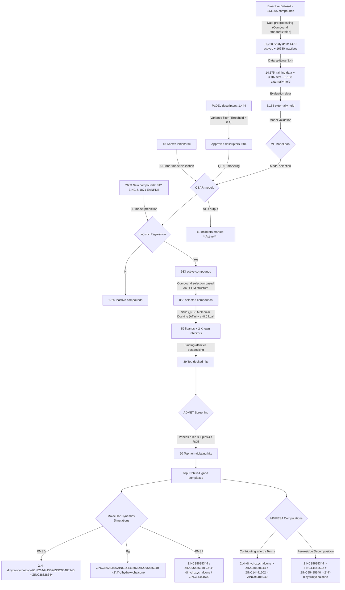

## Antiviral Dengue Drugs Dataset Acquisition

<p align="justify">
This repository contains reproducibility steps for Dengue Virus Inhibitors prediction from natural compounds.
  
The pipeline processes input biosample data to extract biosample IDs, retrieve corresponding SRA accessions, download SRA data, and perform quality control using Fastp.The downloaded data is followed by running the notebooks in this oeder; 1) preprocessing_01.ipynb2) dimentionality_reduction_2_updated.ipynb 3) Hyperparameter_Tuning_machine_learning_3.ipynb and 4) processing_test_dataset_4.ipynb
</p>

```
python descriptorCalculator.py
```

## Data Wrangling and Preprocessing


scripts/descriptorCalculator.py
scripts/molecular_docking.sh
scripts/rank_binding_affinity.py
scripts/split_sdf.py
scripts/toSMI.py
notebooks/EDA_1_Wrangling.ipynb
notebooks/EDA_2_Visualization.ipynb
notebooks/ML_Dengue.ipynb
output/Models
output/Models/LR_model.pkl


## Reproducibility check

## Model Assessment and Validation

## Compounds Prediction

## Envelop protein determination of Ligand binding site

```
python rank_vina
```

## Virtual Screening and Mechanism of Binding Characterization

## ADMET Screening of Selected Compounds

After using OSIRIS DataWarrior, the hits with potential pharmacokinetic and toxicity moieties will be removed.


## Calculations of Ligand-Receptor Complexes using MMPBSA

The binding free energies of the protein-ligand complexes and the individual energy contributions of the residues were calculated using the Molecular Mechanics Poisson-Boltzmann Surface Area (MMPBSA) (Kumari et al., 2014). This is a corroboration method of validating the limitation of the current scoring function (Wang et al., 2018). R programming package was used to plot the graphs from the MMPBSA computations.

> [!NOTE]
> Useful information that users should know, even when skimming content.

> [!TIP]
> Helpful advice for doing things better or more easily.

> [!IMPORTANT]
> Key information users need to know to achieve their goal.

> [!WARNING]
> Urgent info that needs immediate user attention to avoid problems.

> [!CAUTION]
> Advises about risks or negative outcomes of certain actions.


----------

Here is a summary of the data flow chart throughout this research:


